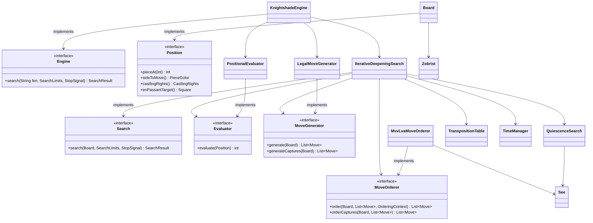
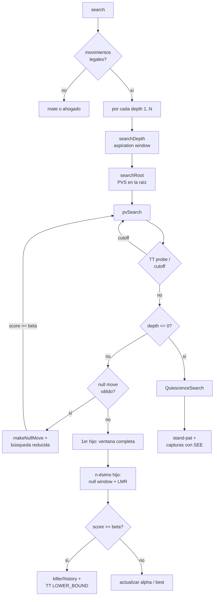
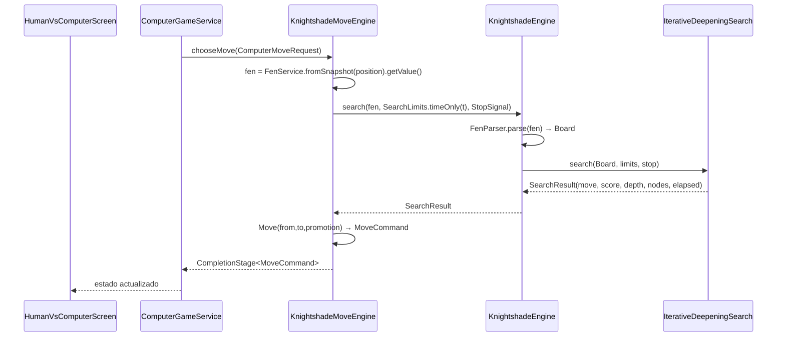

# Knightshade Engine

Motor de ajedrez clásico embebido en LastMove. No usa redes neuronales ni aprendizaje automático: se basa exclusivamente en búsqueda con poda, evaluación heurística y optimización de la fuerza bruta, siguiendo la línea de Crafty, Fruit o las primeras versiones de Stockfish.

- **Paquete raíz:** `com.knightshade.engine`
- **Adaptador en LastMove:** `com.escontrela.lastmove.infrastructure.engine.knightshade`
- **Versión actual:** v3 (descriptor `Knightshade v3`)
- **Fuerza estimada:** ~1200 ELO

---

## 1. Objetivo y fronteras

Knightshade es un componente **independiente del dominio de LastMove**. Cumple tres reglas:

1. **No importa** Spring, JavaFX, Chesspresso ni agregados/servicios de LastMove.
2. Solo reutiliza un *kernel* de value objects inmutables y libres de framework del dominio de LastMove: `Square`, `PieceColor`, `PieceType` y `CastlingRights`.
3. Se comunica con el exterior mediante una única interfaz pública (`Engine`), con el mismo contrato lógico que un motor UCI (`position fen` → `bestmove`) pero **sin proceso externo**.

El adaptador de LastMove es la única pieza que conoce ambos mundos y los traduce entre sí.

---

## 2. Arquitectura interna

```
com.knightshade.engine
├── api/            # Contrato público (Engine, SearchLimits, SearchResult, StopSignal)
├── board/          # Posición, FEN, Zobrist, make/unmake, ataques
├── movegen/        # Generación de movimientos legales
├── evaluation/     # Evaluadores e interfaces
├── ordering/       # Ordenación de movimientos (MVV-LVA, killers, history)
├── search/         # Algoritmos de búsqueda
├── see/            # Static Exchange Evaluation
├── transposition/  # Tabla de transposición
├── time/           # Gestión del tiempo
└── KnightshadeEngine  # Ensamblado por defecto
```



---

## 3. Representación del tablero (`board`)

### 3.1 Mailbox

El tablero es un `int[64]` (mailbox), índice `rank * 8 + file` (a1 = 0, h8 = 63). Cada casilla contiene un entero que codifica la pieza (`Piece`):

- Bits 0–2: tipo (1 peón, 2 caballo, 3 alfil, 4 torre, 5 dama, 6 rey).
- Bit 3: color (0 blanco, 1 negro).
- `0` = casilla vacía.

Es una representación simple y clara (idónea para v0–v3); está **oculta tras la interfaz `Position`**, de modo que migrar a bitboards en v5 no tocará `search` ni `evaluation`.

`Position` es una vista de solo lectura (accesores de estado + `pieceAt`). `Board` es el workspace mutable que la implementa y añade:

- `make(Move)` / `unmake()`: aplica/deshace una jugada con una pila `Undo` que guarda pieza capturada, derechos de enroque, peón al paso, contadores y clave Zobrist.
- `makeNullMove()` / `unmakeNullMove()`: "pasar" el turno (para poda null-move).
- `isSquareAttacked(Square, PieceColor)`, `kingSquare(...)`, `inCheck(...)`: detección de ataques.
- `zobristKey()`: clave hash incremental.

### 3.2 Generación de movimientos (`movegen`)

`LegalMoveGenerator` genera primero movimientos **pseudo-legales** (peón con doble paso/en passant/promoción, saltos de caballo/rey, deslizantes de alfil/torre/dama, enroques) y luego los filtra a **legales** con `make`/`unmake`: el movimiento se rechaza si deja al propio rey en jaque. El enroque verifica además que el rey no cruce ni aterrice en casilla atacada.

`generateCaptures` devuelve solo capturas y promociones (para la quiescence).

### 3.3 Zobrist hashing

`Zobrist` genera claves deterministas (semilla fija) para pieza×casilla, color al mover, 16 combinaciones de enroque y 9 estados de en passant. `Board` mantiene la clave **incrementalmente** (XOR de los deltas en `make`/`unmake`), lo que hace las búsquedas en la TT O(1).

---

## 4. Búsqueda (`search`)

El motor activo es `IterativeDeepeningSearch` (v2+v3), que combina:

### 4.1 Iterative Deepening

Explora profundidad 1, 2, 3… hasta agotar el tiempo (`TimeManager`) o encontrar mate forzado. Garantiza que siempre haya una jugada lista y que la búsqueda pueda detenerse limpiamente entre iteraciones.

### 4.2 Principal Variation Search (PVS)

Negamax con poda alfa-beta: el primer hijo se busca con ventana completa; los demás con ventana nula `(-alpha-1, -alpha)`, re-buscando con ventana completa solo si supera alpha.

### 4.3 Aspiration Windows

En lugar de empezar cada profundidad con `[-INF, +INF]`, se centra la ventana en la puntuación de la iteración anterior ± delta (25 cp), ensanchando el delta al doble ante cada fallo alto/bajo.

### 4.4 Null Move Pruning

Si la posición no está en jaque y hay material no-peón, se "pasa" el turno y se busca con profundidad reducida `R = 2 + depth/4`. Si aun así se supera beta, se poda (evita líneas en las que el oponente puede hacer algo útil). El chequeo de material evita errores en zugzwang.

### 4.5 Late Move Reductions (LMR)

A las jugadas tranquilas (no capturas/promociones/killers) a partir de la 4ª posición de la lista se les reduce 1 ply; si la búsqueda reducida supera alpha, se re-busca a profundidad completa.

### 4.6 Quiescence Search

En las hojas, para evitar el "efecto horizonte", se extiende la búsqueda solo con capturas (y promociones):

- `stand-pat`: se acepta la evaluación estática si ya supera beta.
- Capturas ordenadas por MVV-LVA, **filtrando las perdedoras con SEE** (`See.ge(board, move, 0)`).
- Si el bando está en jaque, se buscan **todas** las evasiones legales (no solo capturas).

### 4.7 Tabla de transposición (`transposition`)

Cache directa por clave Zobrist (mapeo directo, siempre-reemplazo, 2¹⁶ slots) que guarda `(mejorMovimiento, depth, score, tipo)`. Tipos: `EXACT`, `LOWER_BOUND`, `UPPER_BOUND`. Las puntuaciones de mate se ajustan a distancia al moverlas dentro/fuera de la tabla (`Scores.toTable/fromTable`). El reemplazo directo evita bucles (bug histórico de sondeo lineal corregido).

### 4.8 Ordenación de movimientos (`ordering`)

`MvvLvaMoveOrderer` puntúa cada jugada por prioridad:

1. Movimiento de la TT (si existe).
2. Capturas/promociones por MVV-LVA (víctima·10 − atacante), degradando las perdedoras según SEE.
3. Killers primario/secundario (por ply).
4. Movimientos tranquilos por history heuristic.

`KillerMoves` guarda dos refutaciones tranquilas por ply; `HistoryTable` es una butterfly table `[64][64]` bonificada por `depth²` en los cortes beta.



---

## 5. Evaluación (`evaluation`)

Interfaz `Evaluator` (centipawns, positivo = blanco mejor). El evaluador activo es **`PositionalEvaluator`** (v3), que suma:

| Componente | Descripción |
| --- | --- |
| **Material** | `PieceValues`: P=100, N=320, B=330, R=500, Q=900 |
| **Piece-Square Tables** | Bonos posicionales por pieza/casilla (`PieceSquareTables`), reflejados para negras con `index ^ 56` |
| **Movilidad** | Nº de casillas atacadas por N/B/R/Q menos una línea base, ponderado por pieza |
| **Seguridad del rey** | Escudo de peones delante del rey (2 filas × 3 columnas) |

Existen además `MaterialEvaluator` (v0) y `PieceSquareEvaluator` (v1) como pasos intermedios testeados.

### Static Exchange Evaluation (`see`)

`See` evalúa el balance material neto de una captura simulando la secuencia de recapturas en una **copia local** del tablero, eligiendo siempre el **atacante de menor valor** y permitiendo "no recapturar" (`max(0, …)`). Un resultado negativo marca captura perdedora (usada en quiescence y ordenación).

---

## 6. Flujo de integración con LastMove



### 6.1 Cómo usa el modelo de dominio

El motor **reutiliza** cuatro value objects del dominio de LastMove como *kernel* compartido (son inmutables y no dependen de ningún framework):

| Tipo del dominio | Uso en el motor |
| --- | --- |
| `Square` | Coordenadas de casilla; `Position.indexOf(Square)` ↔ `squareOf(int)` convierten a/desde el índice mailbox |
| `PieceColor` | Color de pieza y del bando al mover (`opposite()`) |
| `PieceType` | Tipo de pieza (en `Move.promotion`, `Move.captured`, `Piece.type`) |
| `CastlingRights` | Derechos de enroque (estado y actualización en `make`) |

El motor **no** importa `Fen`, `PositionSnapshot`, `MoveCommand`, `ChessGame` ni ningún agregado/servicio del dominio: define sus propios `Move`, `Position`/`Board` y su propio parser FEN (`FenParser`).

### 6.2 Traducción en el adaptador

El adaptador (`infrastructure/engine/knightshade`) es infraestructura de LastMove y traduce entre ambos mundos:

- **Entrada:** `PositionSnapshot` → `FEN` (vía `FenService.fromSnapshot`) → `Board` (vía `FenParser`). Se reutiliza la serialización FEN ya existente y probada de LastMove, igual que hace Sunfish con `position fen`.
- **Salida:** `Move` del motor → `MoveCommand` del dominio (`from`, `to`, `promotion` como `Optional`).

`KnightshadeMoveEngine` implementa `ComputerMoveEngine` (interfaz de aplicación), ejecuta la búsqueda en un hilo virtual (`CompletableFuture.supplyAsync`) y traduce `cancelSearch()` a un `StopSignal` (`AtomicBoolean`) que la búsqueda consulta entre nodos.

### 6.3 Registro automático en la UI

`KnightshadeMoveEngineProvider` es un `@Component` que implementa `ComputerMoveEngineProvider`. `ComputerGameService.availableEngines()` recoge todos los providers vía inyección de `List<ComputerMoveEngineProvider>`, por lo que **Knightshade aparece automáticamente en el selector de `HumanVsComputerSetupOverlay`** sin tocar la pantalla. También existe `KnightshadeComputerEngineHealthCheck` (probe de jugada legal) siguiendo el patrón de Sunfish.

---

## 7. Evolución por versiones

| Versión | Búsqueda | Evaluación | Optimización |
| --- | --- | --- | --- |
| v0 | Minimax | Material | Make/unmake, ordenación por capturas |
| v1 | Alfa-beta, quiescence | + PST | MVV-LVA, killers |
| v2 | Iterative deepening, PVS | — | Zobrist, TT, history, gestión de tiempo |
| v3 | Aspiration windows, null move, LMR | + movilidad, seguridad del rey | SEE |

Cada versión es funcional y testedada; las clases de búsqueda intermedias (`MinimaxSearch`, `AlphaBetaSearch`) se conservan como pasos de referencia.

---

## 8. Traza

`KnightshadeMoveEngine` registra en el log (slf4j, nivel INFO):

```
Knightshade search started: fen='…' maxTimeMs=500
Knightshade chose e2e4 score=12 depth=7 nodes=153212 elapsedMs=480 totalMs=485
```

---

## 9. Trabajo futuro

- **v4:** desarrollo, control del centro, estructura de peones, peones pasados, pareja de alfiles, finales; opening book.
- **v5:** bitboards, búsqueda paralela (Lazy SMP), optimización de memoria, profiling, tablebases de finales.
