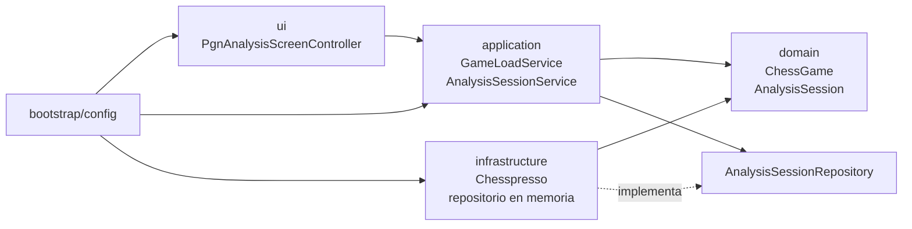
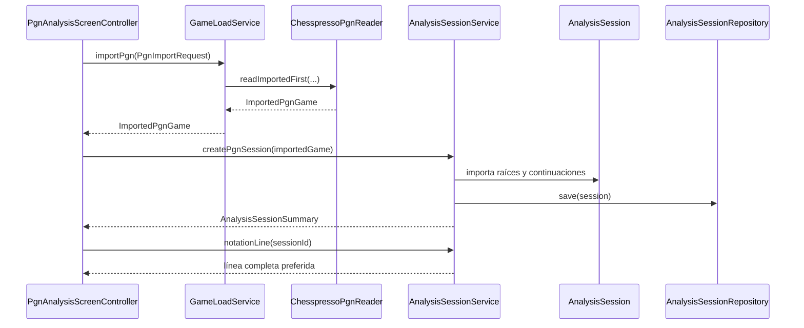
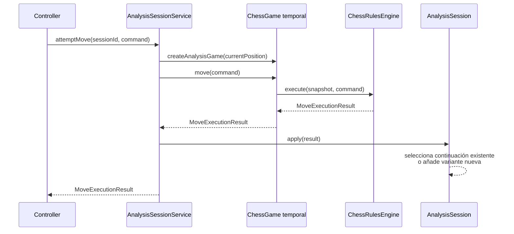
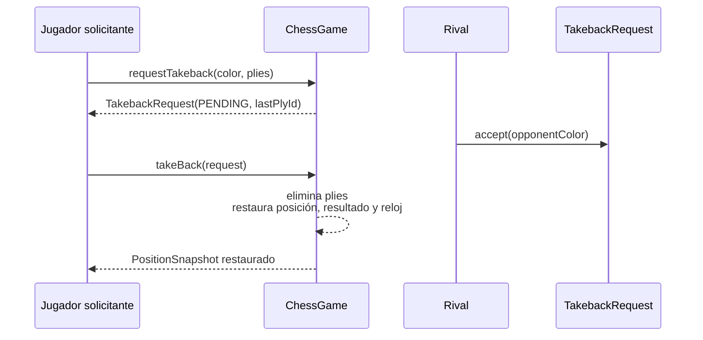

# Arquitectura de partidas y sesiones de análisis

Resumen operativo de la arquitectura actual de LastMove. Para el inventario completo de clases,
atributos y métodos, consulta [Modelo actual: ChessGame y AnalysisSession](proposed-chess-game-analysis-model.md).

## Principios

- `ChessGame` representa una partida progresiva y una única línea oficial.
- `AnalysisSession` representa un estudio navegable con variantes.
- `ChessRulesEngine` desacopla ambos agregados de Chesspresso.
- `AnalysisSessionRepository` es un contrato de aplicación; la implementación en memoria está en
  infraestructura.
- La sesión activa pertenece a `PgnAnalysisScreenController`, no al servicio ni al repositorio.
- El dominio no depende de JavaFX, Spring ni Chesspresso.

## Dependencias por capa



Sólo `infrastructure/chesspresso` puede importar `chesspresso.*`.

## Las cuatro fuentes de una sesión de análisis

| Origen | Entrada | Creación | Resultado |
| --- | --- | --- | --- |
| PGN | `ImportedPgnGame` | `createPgnSession(...)` | Árbol completo importado antes de navegar |
| Posición inicial | — | `createInitialSession()` | Estudio vacío desde la posición estándar |
| FEN | `Fen` | `createFenSession(...)` | Estudio vacío desde el snapshot reconstruido |
| Partida jugada | `GameRecord` | `createFromGame(...)` | Línea oficial copiada como línea principal |

Aunque la UI presenta tres entradas directas —Open PGN, RESET y FEN— el dominio también admite
crear un estudio desde una partida progresiva terminada o en curso.

## Flujo PGN



`GameLoadService` no conoce `AnalysisSessionService`. Importa y devuelve un modelo neutral; el
controlador encadena ambos casos de uso. El PGN se carga completo, incluidas variaciones, antes del
primer render. Por ello la lista de movimientos muestra toda la línea preferida y la selección
avanza sobre elementos ya existentes.

El título vive en `PgnGame.displayTitle()` y se deriva de White, Black y Event. No existe un
`PgnService` sin otra responsabilidad.

## Ejecución de movimientos y variantes



Un resultado rechazado conserva posición, cursor y árbol. Si desde el cursor ya existe la misma
jugada, se selecciona. Si existe otra continuación, la jugada nueva se añade como variante sin
destruir la línea anterior.

`currentLine()` devuelve los plies hasta el cursor. `notationLine()` añade después la continuación
preferida, lo que permite mostrar la línea completa aunque el usuario esté al principio.

`notationNodes()` conserva además la identidad estructural de cada nodo visible. La UI utiliza esa
identidad para seleccionar cualquier SAN de la línea y saltar directamente a su posición.

## Partida progresiva

`ChessGame` mantiene:

- identidad, posición inicial y posición vigente;
- jugadores y control de tiempo opcionales;
- historial oficial `List<Ply>`;
- snapshots de reloj anteriores a cada ply y reloj actual;
- resultado terminal;
- referencia inyectada a `ChessRulesEngine`.

`move(MoveCommand)` sigue siendo la entrada utilizada por el tablero. Como alternativa,
`move(SanMove)` y el atajo `move(String)` permiten jugar con notación algebraica estándar. Ambas
entradas delegan en `ChessRulesEngine` y convergen en la misma transición: sólo mutan el agregado
cuando el resultado es aceptado. Las variantes con `Duration` actualizan el mismo reloj.

`GameStateSnapshot` es una vista derivada; no existe un segundo estado vivo independiente de
`PositionSnapshot`.

## Rectificación consentida



Sólo el rival puede aceptar o rechazar. La solicitud queda anclada a la última jugada existente al
crearla; si la partida avanza, ya no se puede aplicar. La rectificación no crea una variante porque
la partida conserva una única línea oficial.

## Conversión de partida a estudio

```text
ChessGame
  -> toRecord()
GameRecord inmutable
  -> AnalysisSessionFactory.fromGame(record)
AnalysisSession(PLAYED_GAME)
  -> AnalysisSessionRepository.save(...)
```

`GameRecord` contiene posición inicial, participantes, control de tiempo, resultado y
`RecordedPly`, con reloj antes y después de cada jugada. Excluye el motor de reglas y la mutabilidad
del agregado.

La sesión resultante es una copia independiente. Continuar o rectificar la partida no cambia el
estudio, y añadir variantes al estudio no altera el historial oficial.

## Sesiones en memoria y selección UI

`InMemoryAnalysisSessionRepository` conserva sesiones por identidad y las lista de creación más
reciente a más antigua. No guarda una sesión activa.

`PgnAnalysisScreenController` conserva `activeAnalysisSessionId`. La lista lateral y el modal de
sesiones obtienen `AnalysisSessionSummary` mediante `listSessions()` y pueden cambiar el
identificador seleccionado. Otra pantalla puede mantener simultáneamente otra selección sin
interferencias.

`SessionSelectorControl` reemplaza la antigua lista de strings. Renderiza cada sesión mediante una
cell virtualizada, reserva una columna estable para la marca `✓` de la sesión activa y emite eventos
neutrales de selección y solicitud de contexto. Al pedir contexto sobre una fila, el controlador la
activa y reconstruye `ContextualMenuPanel` con acciones específicas de sesión.

`Rename session…` abre la edición del título y delega en
`AnalysisSessionService.renameSession(...)`. El agregado valida y aplica el nuevo título mediante
`AnalysisSession.rename(...)`; identidad, árbol, posición y cursor permanecen intactos. El
repositorio sólo guarda después el agregado actualizado.

### Control reutilizable de notación

`MoveNotationControl` sustituye la antigua lista vertical de strings. Internamente mantiene un
único `ListView<MoveNotationRow>` virtualizado: cada fila representa un número de movimiento y
contiene columnas independientes para blancas y negras. Cada SAN es un botón accesible y
seleccionable, con estados hover, focus y current definidos mediante CSS para modo claro y oscuro.

El control recibe `MoveNotationEntry`, que sólo contiene índice visible, número, color y SAN, y
emite `PlySelectedEvent`. No conoce sesiones, árboles ni reglas, por lo que también puede utilizarse
en una futura pantalla de partida progresiva. El controlador traduce el índice visible a
`AnalysisNodeSummary` y delega la navegación en `AnalysisSessionService.select(...)`.

Se eligió una lista virtualizada con cells compuestas frente a dos listas sincronizadas o
RichTextFX. Para una línea de jugadas en dos columnas ofrece selección y teclado nativos, scroll
único y coste constante al mostrar PGN largos. RichTextFX sigue disponible para un futuro editor de
PGN con comentarios, NAG y variantes inline, donde el texto enriquecido sí aporta más valor.

## Responsabilidades del controlador

El controlador:

- abre PGN y conecta importación con creación de sesión;
- crea sesiones RESET y FEN;
- conserva la selección exclusiva de la pantalla;
- envía movimientos y navegación al servicio;
- renderiza snapshot, notación y sesiones en memoria.

No valida movimientos, no importa PGN directamente, no modifica `AnalysisTree` y no conoce tipos
Chesspresso.

## Flechas de cálculo del tablero

`ChessBoardControl` conserva una lista exclusivamente visual de `BoardArrow`. La piel añade un
overlay transparente sobre las casillas y piezas:

- press y drag con botón secundario define origen, preview y destino;
- release alterna la flecha, permitiendo retirar un trazo repetido;
- doble clic secundario elimina todas las flechas;
- cambiar el `PositionSnapshot` también las limpia;
- el evento `CONTEXT_MENU_REQUESTED` se consume dentro del tablero, por lo que no abre el menú
  contextual de la pantalla.

Las flechas no forman parte de `ChessGame`, `AnalysisSession` ni del PGN. Son una ayuda efímera de
presentación y, por tanto, el mismo control puede utilizarlas tanto en análisis como en una partida
regular.

## Partida Human vs Computer y ciclo UCI

`HumanVsComputerScreenController` conserva el `GameId` activo de su pantalla y renderiza los DTO
de `ComputerGameService`. El servicio coordina `ChessGame`, `ProgressiveGameRepository` y una
instancia exclusiva de `ComputerMoveEngine`; el repositorio no contiene ninguna selección activa.

Al terminar, `ChessGame.toRecord()` produce un `GameRecord` inmutable.
`AnalysisSessionService.createFromGame(...)` delega en `AnalysisSessionFactory`, guarda una sesión
`PLAYED_GAME` independiente y la interfaz navega directamente a ella. Reiniciar reemplaza partida,
identificador y proceso UCI conservando la configuración elegida.

`UciProcessEngine` serializa el protocolo en un hilo virtual y consume stdout en otro. Todos los
handshakes y búsquedas tienen timeout. Una cancelación envía `stop`, consume el `bestmove` pendiente
y mantiene el proceso reutilizable; una caída, salida inválida o timeout invalida y termina el
proceso para que ninguna respuesta tardía contamine la siguiente búsqueda. `close()` envía
`stop`/`quit` y escala a destrucción forzosa si el motor no responde. El `@PreDestroy` de
`ComputerGameService`, invocado al cerrar Spring desde `JavaFxApplication.stop()`, cierra todas las
instancias restantes para no dejar procesos Python vivos.

La cobertura específica incluye caída durante búsqueda, salida inválida, búsqueda bloqueada,
cancelación, revocación con respuesta tardía, timeout humano y del motor, cierre resistente a un
motor que ignora `quit`, y cierre global de todas las partidas.

## Verificación automatizada

La suite automatizada cubre:

- creación desde posición inicial, FEN, PGN y `GameRecord`;
- carga completa de la línea PGN antes de navegar;
- variantes importadas y creadas desde el tablero;
- navegación y aislamiento entre sesiones;
- movimientos ilegales, captura, enroque, promoción y en passant;
- jaque, mate y ahogado;
- rectificación, consentimiento, solicitudes obsoletas y restauración de relojes;
- conversión independiente de partida a estudio;
- orden de sesiones en el repositorio y arranque Spring.

Comando de referencia:

```bash
mvn clean test
```
