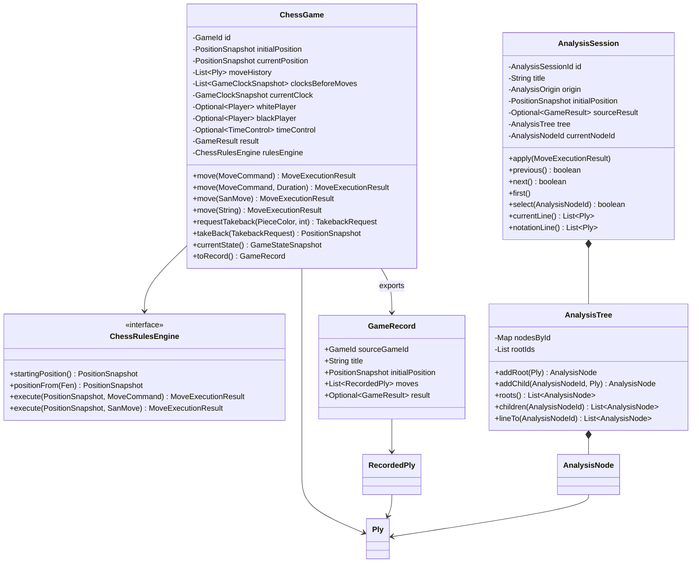

# Modelo actual: `ChessGame` y `AnalysisSession`

Este documento describe el modelo implementado después de la refactorización de partidas y
sesiones de análisis. El nombre del archivo se conserva para no romper enlaces existentes, pero el
contenido ya no es una propuesta: refleja el código actual.

## Objetivo y separación de agregados

El dominio distingue dos conceptos con ciclos de vida diferentes:

- `ChessGame`: partida progresiva con una única línea oficial, jugadores, resultado y reloj.
- `AnalysisSession`: estudio navegable con cursor y árbol de variantes no destructivas.

Una partida no se convierte en un árbol al rectificar una jugada. Una sesión de análisis no se
convierte en una partida real al ejecutar una continuación. Ambos reutilizan `Ply`,
`PositionSnapshot`, `MoveCommand` y `MoveExecutionResult`, pero mantienen invariantes distintas.



## Distribución por capas

```text
domain
├── common
│   ├── PieceColor
│   ├── PieceType
│   └── Square
├── game
│   ├── ChessGame, ChessGameFactory, ChessRulesEngine
│   ├── GameId, Player, TimeControl, GameClockSnapshot
│   ├── TakebackRequest, TakebackStatus
│   ├── GameRecord, RecordedPly
│   ├── Ply, MoveCommand, MoveDescriptor, MoveExecutionResult
│   ├── PositionSnapshot, PositionPiece, CastlingRights, GameStateSnapshot
│   └── ImportedPgnGame, ImportedPly
├── analysis
│   ├── AnalysisSession, AnalysisSessionFactory, AnalysisOrigin
│   ├── AnalysisTree, AnalysisNode
│   └── AnalysisSessionId, AnalysisNodeId
├── notation
│   ├── Fen
│   ├── SanMove
│   └── PgnGame
└── service
    └── FenService

application
├── service
│   ├── GameLoadService
│   └── AnalysisSessionService
├── repository
│   └── AnalysisSessionRepository
└── dto
    ├── PgnImportRequest
    ├── AnalysisSessionSummary
    └── AnalysisNodeSummary

infrastructure
├── chesspresso
│   ├── ChesspressoRulesEngine
│   ├── ChesspressoPgnReader
│   └── mappers de FEN, posición y PGN
├── session
│   └── InMemoryAnalysisSessionRepository
└── config
    └── LastMoveConfiguration

ui
└── controller
    └── PgnAnalysisScreenController
```

La dependencia efectiva del flujo es `ui -> application -> domain`. Infraestructura implementa
contratos o traduce formatos técnicos hacia tipos neutrales. Sólo
`infrastructure/chesspresso` importa clases `chesspresso.*`.

## Dominio de partida progresiva

### `ChessGame`

Agregado raíz para una partida lineal. Su estado principal es:

- `id: GameId`.
- `initialPosition` y `currentPosition: PositionSnapshot`.
- `moveHistory: List<Ply>` como línea oficial.
- `clocksBeforeMoves: List<GameClockSnapshot>` y `currentClock`.
- jugadores blanco y negro opcionales.
- control de tiempo y resultado opcionales.
- `rulesEngine: ChessRulesEngine`, colaborador inyectado y no persistible.

Operaciones públicas principales:

- `move(MoveCommand)`: ejecuta una jugada sin tiempo transcurrido explícito.
- `move(MoveCommand, Duration)`: ejecuta la jugada y actualiza el reloj del jugador que movió.
- `move(SanMove)` y `move(String)`: entrada alternativa en notación algebraica estándar.
- `move(SanMove, Duration)` y `move(String, Duration)`: alternativa SAN con reloj.
- `requestTakeback(PieceColor, int)`: crea una solicitud para deshacer uno o más plies.
- `takeBack(TakebackRequest)`: aplica una solicitud aceptada y restaura todo el estado anterior.
- `currentState()`: devuelve un `GameStateSnapshot` derivado de la posición vigente.
- `toRecord()`: exporta un `GameRecord` inmutable.

Invariantes:

- Una jugada rechazada no modifica posición, historial, resultado ni reloj.
- Un resultado aceptado debe contener descriptor y flags coherentes con el snapshot resultante.
- El último ply produce exactamente la posición vigente.
- Los snapshots de reloj y los plies forman líneas temporales del mismo tamaño.
- Una partida terminada no admite nuevas jugadas.
- Una rectificación sólo se aplica tras aceptación del rival y si la partida no avanzó desde la
  solicitud.

### `ChessRulesEngine` y `ChessGameFactory`

`ChessRulesEngine` es un contrato de dominio sin estado:

- `startingPosition()`.
- `positionFrom(Fen)`.
- `execute(PositionSnapshot, MoveCommand)`.
- `execute(PositionSnapshot, SanMove)`.

`ChessGameFactory` inyecta ese contrato al crear o rehidratar agregados:

- `createInitial(Player, Player, Optional<TimeControl>)`.
- `createFrom(Fen, Player, Player, Optional<TimeControl>)`.
- `createAnalysisGame()` y sobrecargas desde FEN o snapshot.
- `resume(...)`, incluyendo historial y línea temporal de relojes.

La implementación actual es `ChesspressoRulesEngine`; puede sustituirse sin cambiar `ChessGame`.

### Posiciones, comandos y resultados

`PositionSnapshot` contiene todo lo necesario para reconstruir una posición:

- piezas, color activo y derechos de enroque;
- objetivo en passant;
- halfmove clock y fullmove number de FEN;
- último movimiento;
- flags de jaque, mate y ahogado.

`MoveCommand` contiene origen, destino y promoción opcional y sigue siendo la entrada natural del
tablero. `SanMove` es una entrada alternativa textual que se resuelve respecto a la posición actual;
no mantiene otro flujo de partida. `MoveDescriptor` describe la jugada finalmente aceptada mediante
SAN, captura, enroque, en passant y promoción. `MoveExecutionResult` separa la validación de la
aplicación del resultado y expone:

- aceptación y motivo de rechazo;
- snapshot resultante y descriptor opcional;
- pieza capturada opcional;
- jaque, mate y ahogado;
- destinos legales del turno siguiente.

`Ply` añade identidad UUID, número de movimiento, color que movió y posición resultante. Es neutral:
no contiene padre, hijos ni cursor.

### Jugadores, tiempo y rectificación

`Player` contiene nombre, color y Elo opcional. `TimeControl` admite controles temporizados y el
modo `unlimited()`; ofrece `of(...)` y `fifteenPlusTen()`.

`GameClockSnapshot` conserva el tiempo restante de ambos colores. Por cada jugada oficial,
`RecordedPly` relaciona el ply con el reloj inmediatamente anterior y posterior.

`TakebackRequest` tiene estados `PENDING`, `ACCEPTED`, `REJECTED` y `APPLIED`. La crea el propio
agregado, queda anclada al UUID del último ply y sólo puede responderla el color contrario. Una
respuesta tardía no puede deshacer movimientos jugados después de crear la solicitud.

### `GameRecord`

Es la exportación inmutable de una partida progresiva. Incluye identidad de origen, título,
posición inicial, jugadores, control de tiempo, `List<RecordedPly>` y resultado. No contiene el
motor ni referencias mutables al agregado.

## Dominio de análisis

### `AnalysisSession`

Agregado raíz de un estudio. Contiene:

- identidad, título y `AnalysisOrigin`;
- posición inicial;
- resultado declarado por la fuente (`sourceResult`), independiente del cursor;
- `AnalysisTree`;
- cursor `currentNodeId`, posición y resultado reglamentario del cursor.

Los orígenes actuales son `PGN`, `INITIAL_POSITION`, `FEN` y `PLAYED_GAME`.

Operaciones principales:

- `apply(MoveExecutionResult)`: añade una continuación o selecciona una idéntica ya existente.
- `previous()`, `next()` y `first()`.
- `select(AnalysisNodeId)`.
- `currentLine()`: desde la raíz hasta el cursor.
- `notationLine()`: línea actual más la continuación preferida por delante del cursor.
- `rootVariations()` y `continuations(AnalysisNodeId)`.
- `currentPosition()`, `currentState()`, `currentPly()` y `sourceResult()`.

Al mover desde un ply que ya tiene continuación, la nueva jugada se añade como otro hijo. Nunca se
elimina silenciosamente la línea anterior. El primer hijo conserva el papel de continuación
preferida para la navegación con `next()`.

### `AnalysisTree` y `AnalysisNode`

`AnalysisTree` es el único propietario de la topología. Mantiene mapas por identidad y raíces en
orden de inserción. Ofrece `addRoot`, `addChild`, `node`, `find`, `findByPlyId`, `roots`, `children`
y `lineTo`.

`AnalysisNode` envuelve un `Ply` y conserva `parentId` y `continuationIds`. El cursor y la posición
vigente no pertenecen al árbol, sino a `AnalysisSession`.

### Importación PGN

`ImportedPgnGame` agrupa un `PgnGame` neutral y sus variantes raíz. Cada `ImportedPly` contiene un
resultado aceptado y sus continuaciones. Esta estructura permite importar toda la línea y las
variantes antes de empezar a navegar; por eso la lista de movimientos puede mostrarse completa
desde el primer render.

El título del estudio PGN se obtiene con `PgnGame.displayTitle()`, que encapsula los headers White,
Black y Event. No existe un `PgnService` dedicado únicamente a construir títulos.

### Conversión de una partida jugada

`AnalysisSessionFactory.fromGame(GameRecord)` copia la línea oficial a una sesión de origen
`PLAYED_GAME`. `AnalysisSessionService.createFromGame(...)` la registra en el repositorio. El
estudio y la partida quedan desacoplados: una rectificación posterior no cambia el estudio y una
variante de análisis no cambia la partida.

## Capa de aplicación

### `GameLoadService`

Importa una fuente PGN desde `PgnImportRequest` y devuelve `ImportedPgnGame`. No crea ni registra
sesiones. El controlador decide después si crea una sesión PGN.

### `AnalysisSessionService`

Coordina `AnalysisSessionRepository`, `ChessGameFactory` y `AnalysisSessionFactory`. No contiene
reglas de ajedrez ni una sesión activa global.

API principal:

- creación: `createInitialSession`, `createFenSession`, `createPgnSession` y `createFromGame`;
- consulta: `listSessions`, `sessionSummary`, `currentPosition`, `gameState`, `moveHistory` y
  `notationLine`;
- variantes: `rootVariations` y `continuations`;
- ejecución: `attemptMove`;
- navegación: `previous`, `next`, `first` y `select`.

Para validar una continuación crea un `ChessGame` temporal desde el snapshot del cursor, ejecuta
`move(...)` y entrega el resultado neutral a `AnalysisSession.apply(...)`.

### Repositorio y DTO

`AnalysisSessionRepository` pertenece a aplicación y define `save`, `findById` y
`findAllByMostRecent`. `InMemoryAnalysisSessionRepository`, en infraestructura, conserva las
sesiones durante el proceso y las lista de más reciente a menos reciente.

Ni repositorio ni servicio guardan una sesión activa. Esa selección pertenece a cada pantalla.

`AnalysisSessionSummary` expone identidad, título, origen, posición actual y resultado de la
fuente. `AnalysisNodeSummary` expone nodo, ply y número de continuaciones sin entregar el agregado
mutable a la UI.

## Infraestructura y presentación

`ChesspressoRulesEngine` valida movimientos especiales, calcula SAN y devuelve snapshots neutrales.
`ChesspressoPgnReader` traduce el PGN completo a `ImportedPgnGame`. Ningún tipo de Chesspresso
escapa de `infrastructure/chesspresso`.

`PgnAnalysisScreenController` conserva `activeAnalysisSessionId`, importa PGN, crea sesiones RESET
y FEN, cambia entre sesiones, delega movimientos y navegación, y renderiza tablero y notación. La
lista de sesiones en memoria y el modal usan `listSessions()`. El controlador no manipula el árbol
ni valida reglas.

## Ejemplo de partida progresiva

```java
Player white = new Player("Alice", PieceColor.WHITE, 1800);
Player black = new Player("Bob", PieceColor.BLACK, 1750);

ChessGame game =
    chessGameFactory.createInitial(
        white, black, Optional.of(TimeControl.fifteenPlusTen()));

MoveExecutionResult e4 =
    game.move(
        new MoveCommand(Square.of("e2"), Square.of("e4"), Optional.empty()),
        Duration.ofSeconds(4));

assertTrue(e4.accepted());
assertEquals(PieceColor.BLACK, game.currentTurn());
assertFalse(game.isCheck());
assertFalse(game.isCheckmate());
assertFalse(game.isStalemate());
```

La misma partida puede escribirse en SAN sin cambiar el modelo aplicado:

```java
game.move("e4");
game.move("e5");
game.move(SanMove.of("Nf3"));
```

## Ejemplo de rectificación

```java
TakebackRequest request = game.requestTakeback(PieceColor.WHITE, 2);
request.accept(PieceColor.BLACK);
PositionSnapshot restored = game.takeBack(request);

assertEquals(TakebackStatus.APPLIED, request.status());
assertEquals(restored, game.currentPosition());
```

## Ejemplo de conversión a análisis

```java
GameRecord record = game.toRecord();
AnalysisSessionSummary study = analysisSessionService.createFromGame(record);

assertEquals(AnalysisOrigin.PLAYED_GAME, study.origin());
assertEquals(record.result(), study.sourceResult());
```

## Decisiones arquitectónicas vigentes

1. Partida progresiva y estudio son agregados distintos.
2. `Ply` es neutral; `AnalysisNode` aporta la ramificación.
3. Las reglas se sustituyen implementando `ChessRulesEngine`.
4. El repositorio de sesiones es una interfaz de aplicación; su implementación es infraestructura.
5. La sesión activa pertenece al controlador, nunca al servicio o repositorio.
6. `GameLoadService` sólo importa; `AnalysisSessionService` crea y registra estudios.
7. Las rectificaciones mantienen una única línea oficial y requieren consentimiento.
8. La conversión utiliza una copia `GameRecord`, evitando compartir agregados mutables.

## Cobertura automatizada

Las pruebas actuales verifican creación desde posición inicial, FEN, PGN y partida jugada;
importación completa y variantes; navegación y aislamiento entre sesiones; movimiento ilegal,
captura, enroque, promoción, en passant, mate y ahogado; relojes y rectificación; orden del
repositorio en memoria; y arranque del contexto Spring.
